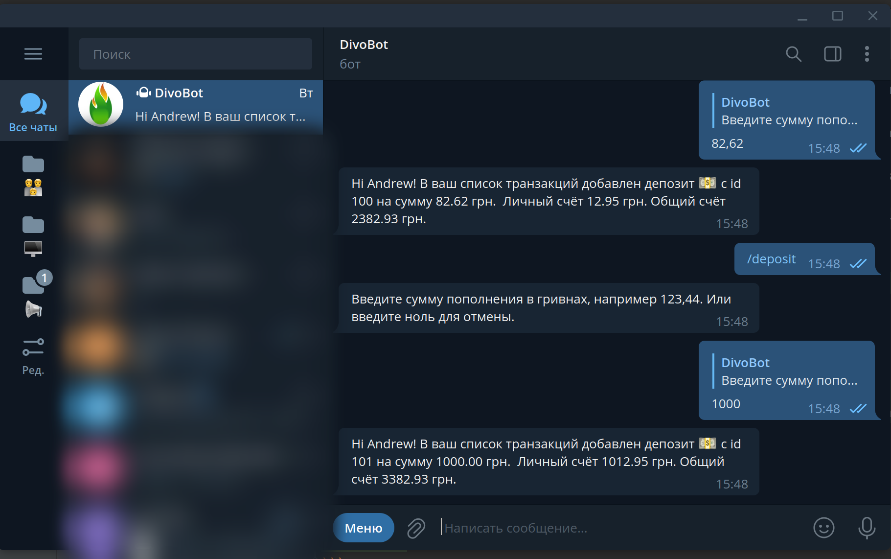

This project was wrote as learning but has a useful function.
You can share one balance of fuel account with your friends.  
For example, you have OKKO Fuel account and 5 friends. Each of them add money and get fuel after that.
All dialogs will take by Telegram bot.
Administrator can handle process via REST requests and access of the Database.

At the current time it works successful and very helped me and my friends during Fuel Crisis exists. 

Production works at Digitalocean image (Ubuntu + NodeJS + MySQL + Nginx + Docker + PM2). 



```bash
# Build DOCKER container
docker build . -t agrow/nodejs-web-app
```

```bash
# Run image with -d will create background process. 
# Flag -p will forward a public port to the private port inside the container. 
docker run -p 49160:8080 -d agrow/nodejs-web-app
```

```bash
# Show all containers for getting ID of the container.
$ docker ps
```

```bash
# Show logs from the container
$ docker logs <container_id>
```

```bash
# Entry for interaction mode.
$ docker exec -it <container id> /bin/bash
```

```bash
docker-compose build # build container with database
docker-compose up # run container with database
```

```bash
docker stop $(docker ps -a -q) # Stop all running containers
docker rm $(docker ps -a -q) # Delete all stopped containers
docker system prune -a # remove all containers and images
```

```bash
# Deploy changes to production
ssh USER@IP_ADDRESS -p 2202 # connect to production on local desktop
## next commands run on remote server!
cd ~/divo-nodejs/ # open a folder with app
git pull origin master # get updates from git
npm install # rebuild dependencies
pm2 restart server # run restart
```

```bash
npm run docker # run docker by JS script
npm run server # run server by JS script
```

```bash
npm run dbmigrate # run migrations
npm run dbseed # run seeds
```